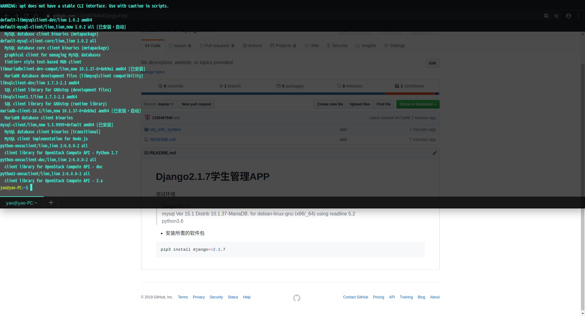
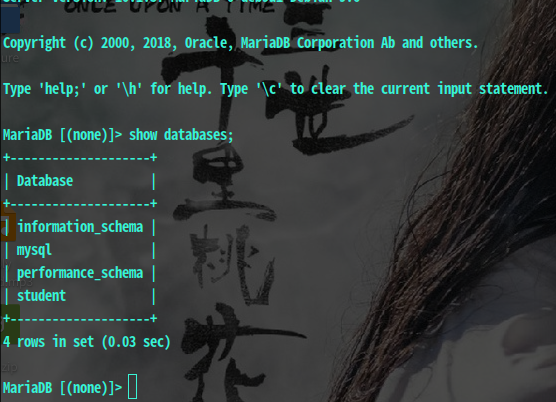
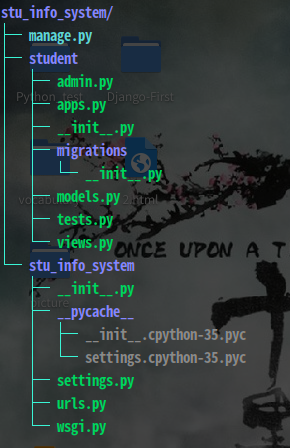

# Django2.1.7学生管理APP  
测试环境  
>Deepin15.11  
>mysql  Ver 15.1 Distrib 10.1.37-MariaDB, for debian-linux-gnu (x86/_64) using readline 5.2  
>python3.6  
## 1.安装所需要的软件包
* 安装Django2.1.7  
```python
pip3 install django==2.1.7
```
* 安装mysql  
```python
sudo apt-get install mysql
```
* 安装pymysql  
```python
pip3 install pymysql
```
* 安装mysqlclient  
```python
pip3 install mysqlclient
```
在安装mysqlclient的时候，出现了mysql.conf文件缺失的错误，网上找到的解决办法是安装mysql-devel组件，但是在deepin上找不到这个，安装了下面这些包解决了问题  
  
## 2.创建项目  
django startproject stu/_info/_system  
stu/_info/_system为项目名称，桌面上新建的stu/_info/_system文件夹就是工程的文件夹  
文件夹结构如下:  
  
## 3.创建(学生信息管理)APP
进入stu/_info/_system文件夹  
```python
cd stu/_info/_system
```
创建名为stuent的APP  
```python
python3 manage.py startapp student
```
查看目录结构  
  

